# 🎥📻VIDEO📼📷📺AND💾📹THE📼📷INTERNET💻
#### .・゜:✧･ﾟ: *✧･ﾟ:* SJSU Art 75 | Fall 2018 *:･ﾟ✧*:･ﾟ✧
 

## ▼△▼△▼△▼ Video Art & the Internet

**Related:**  
[Net Art Anthology](https://anthology.rhizome.org/) 
[Art in the Age of the Internet exhibition](https://www.icaboston.org/exhibitions/art-age-internet-1989-today)  
[I Was Raised on the Internet exhibition](https://mcachicago.org/Exhibitions/2018/I-Was-Raised-On-The-Internet)
 
 

**Nam June Paik, "Internet Dream", 1994** 
An example of an early video art response to the internet, Internet Dream is a stack of 52 monitors displaying jarring abstract images reflecting digital information saturation.

[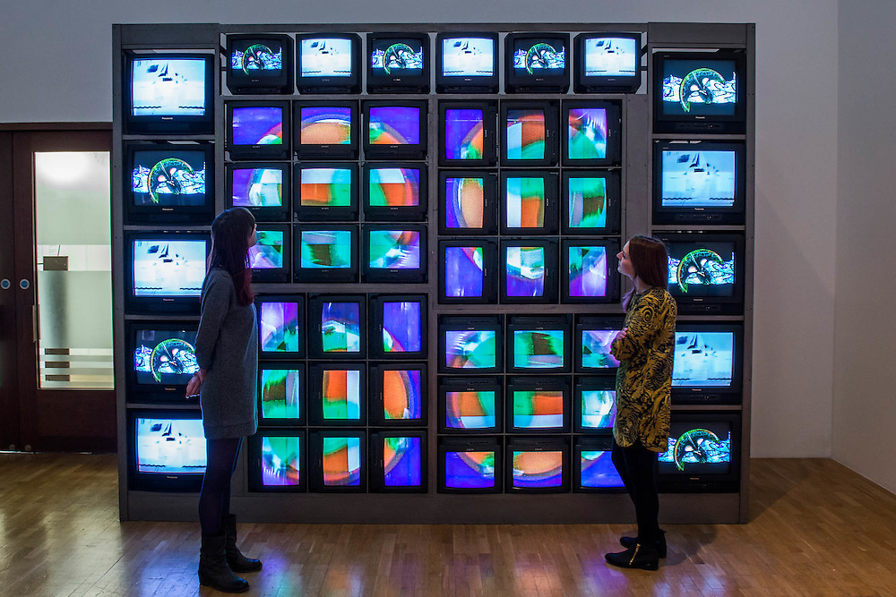](https://www.youtube.com/watch?v=G6W-8w1ZtvI)

 
 

**HOWDOYOUSAYYAMINAFRICAN, "thewayblackmachine.net", 2014-ongoing** 
Yams Collective is a 38 member collective. Their video piece- [thewayblackmachine.net](http://thewayblackmachine.com/)- (seen below across from Paik’s) is a twenty-four-screen video installation, which compiles video recordings of police brutality since 2014, ultimately syncing into videos of protestors, before dissolving into static.

[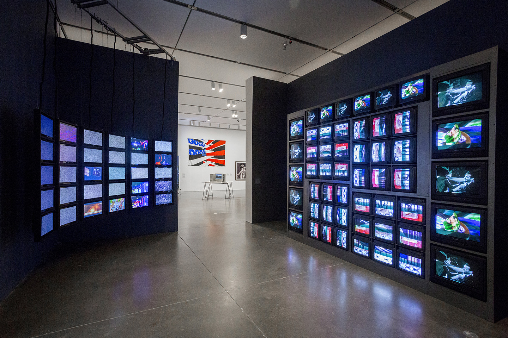](http://magazine.art21.org/2014/12/02/the-yams-collective-insurrection-and-resistance/#.W43ew5NKjPB)

Constructed from material primarily collected from social media, hashtags on Twitter and Instagram, press footage, and statistical data drawn from research on race and discrimination, the fast-moving simultaneous videos unravel different combinations of images. It is purposely presented from the point of view of communal and public citizenship. The shooting death of Michael Brown in Ferguson, Missouri takes center stage in this video installation.

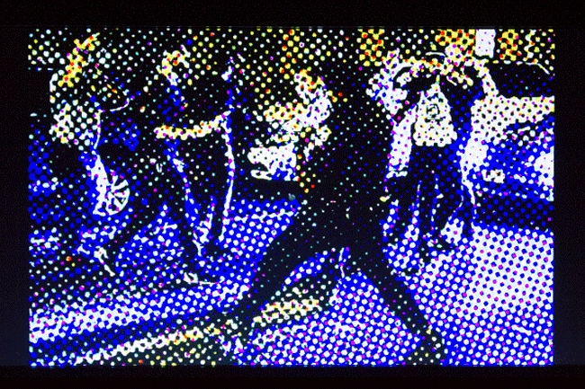

 
 

**Camille Henrot’s "Gross Fatigue", 2013** 
This video was put together while the artist was at the Smithsonian in residence. She is interested in the creation, organization, and distribution of knowledge, specially through the problematic lens of colonialist institutions. In this video, she collected creation myths from various cultures and worked with a spoken word artist to create the narration telling the stories of these myths.

(click below for video excerpts and interview with the artist)

[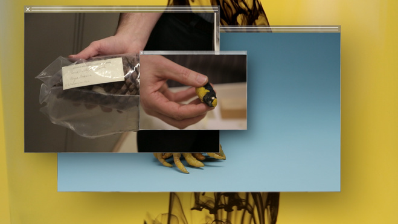](https://vimeo.com/86174818)

We hear phrases from the stories while drawer after drawer of the Smithsonian archives is opened, showing preserved animal specimens or statuettes, and browser window on top of browser window is opened with more images and videos layering on top of one another.

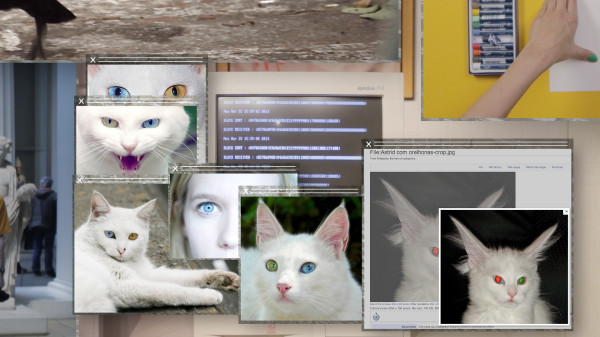

 
 

**Hito Steyerl’s "How Not to Be Seen: A Fucking Didactic Educational .MOV File", 2013
**  
How Not to Be Seen—a video by artist Hito Steyerl—presents five lessons in invisibility. Her work is fueled by her critical examination of the production, use, and circulation of images from the mid-twentieth century into the Information Age. Referring to the countless images generated and circulated by such sources as social media and surveillance technologies, and the impact of these technologies on our lives, she asks: “How do people disappear in an age of total over-visibility?…Are people hidden by too many images?…Do they become images?” [(from Moma site)](https://www.moma.org/learn/moma_learning/hito-steyerl-how-not-to-be-seen-a-fucking-didactic-educational-mov-file-2013)

[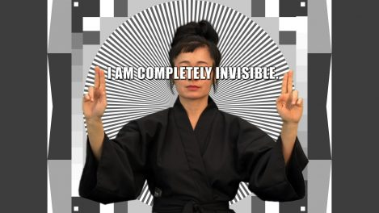](https://www.artforum.com/video/hito-steyerl-how-not-to-be-seen-a-fucking-didactic-educational-mov-file-2013-51651)

A satirical take on instructional films, _How Not to Be Seen_ features a mix of actual and virtual performers and scenes, which illustrate the strategies for becoming invisible, communicated in an authoritative narrative voiceover. Among the video’s central symbols is a real place: a patch of marked concrete in the California desert once used by the U.S. Air Force to calibrate their surveillance cameras. The concrete is riddled with cracks and desert scrub. As the artist indicates throughout her video, sites like this have fallen into disrepair not because surveillance has stopped, but because more advanced systems are now in use, which do not need to be tested there. These newer systems ensure that we are always visible, and might benefit from her lessons in how not to be seen.

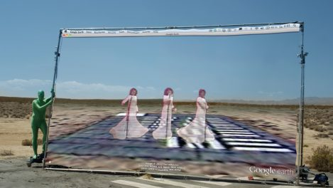

 
 

**Francis Alÿs, “Sometimes Doing Is Undoing and Sometimes Undoing Is Doing", 2013**

Filmed in 2013 at the Forward Operating Base Shawqat, Helmand province, where Alÿs was officially “embedded” with the UK military in Spring 2013 and in Herat in Western Afghanistan, where he was unofficially “embedded” with Taliban that same year. The films are played on a split screen and show two soldiers—one a member of the Western forces still occupying the country on the side of the official government and the other a Taliban anti-government fighter—as they take apart and reassemble their weapons, each in their own separate world.
 

While the British soldier is filmed standing up at a table outdoors in a military camp with trucks moving in the background, suggesting a complex and institutionalized world in which his actions are inscribed, the Taliban soldier sits on a rug dressed in traditional Pashtu attire. His gestures are smoother than his British counterpart’s, and there is a tighter mind/body alliance. [(from francisalys.com)](http://francisalys.com/sometimes-doing-is-undoing-and-sometimes-undoing-is-doing/)

 
 

**Sophia Al Maria, "Black Friday", 2016**

Sophia Al Maria ties together public space and digital space in Black Friday. It is a rumination on shopping malls everywhere as secular temples of capitalism. She describes the mall as a space that occupies "a weirdly neutral shared zone between cultures that are otherwise engaged in a sort of war of information and image."

[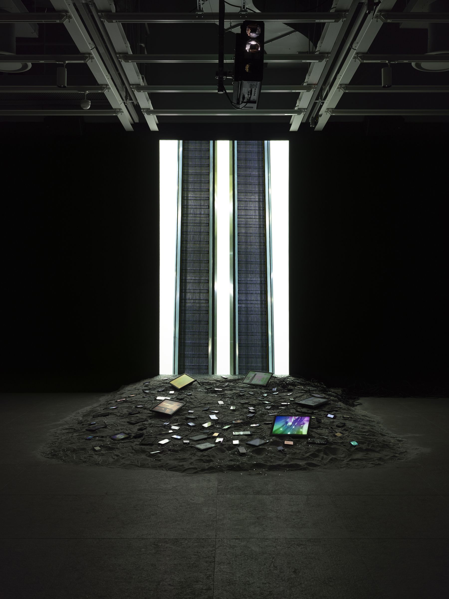](https://vimeo.com/217134773)

Beneath the projected video lies "The Litany", an installation of flickering electronic devices displaying short, glitchy loops—a heap of old screens that acts as a coded history of consumption, conflict, and desire.

[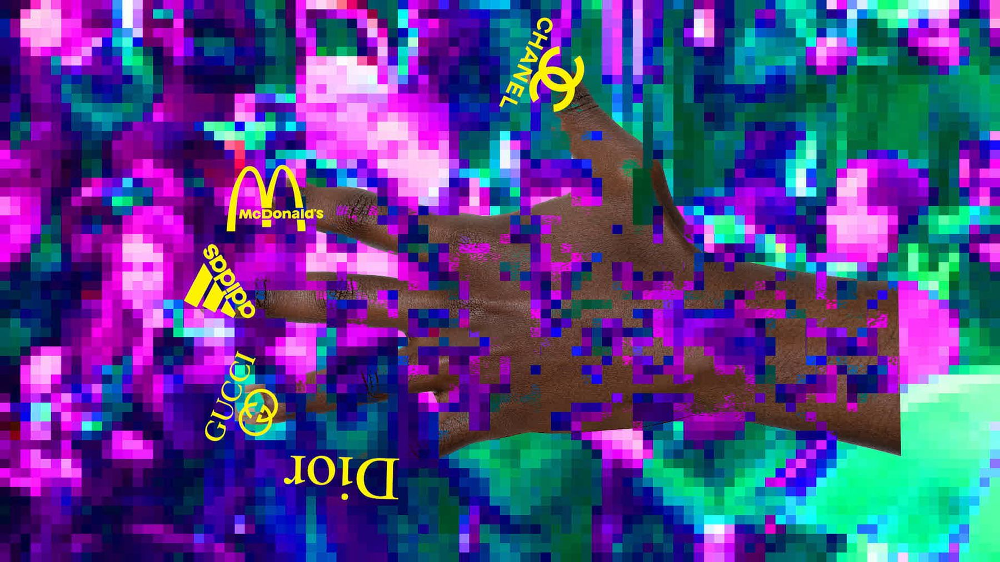](https://vimeo.com/203685977)

 
 

**Jeremy Bailey, "Nail Art Museum", 2014** 
A satirical how-to, diaristic video that reflects New Media art, the art world, and internet surveillance.

"Since the early noughties Bailey has ploughed a compelling, and often hilarious, road through the various developments of digital communications technologies. Ostensibly a satire on, and parody of, the practices and language of "new media," the jocose surface of Bailey’s work hides an incisive exploration of the critical intersection between video, computing, performance, and the body." – Morgan Quaintance, Rhizome

[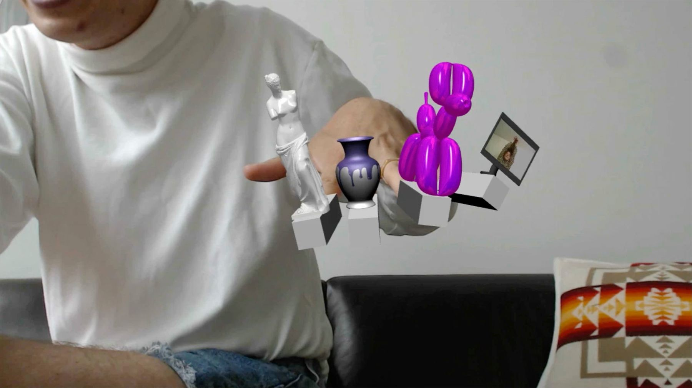](https://www.youtube.com/watch?v=40pSU5ZM784)

 
 

**Sofía Córdova, "YUNG NARCISX (wile out and cut your bangs, no one is looking)"", 2017**
 link here: https://www.sofiacordova.com/YUNG-NARCISX

“YN is a video meditation on the multivalent and many-layered performances of otherness placed upon bodies of color on the internet. At once seduced and repulsed by the draw of living life publicly online, through this piece I look at the potent contradiction of taking up space and claiming visibility through social media and the simultaneous way that social media companies immediately commodify and makes advertising out of this same action.” -Sofía Córdova

[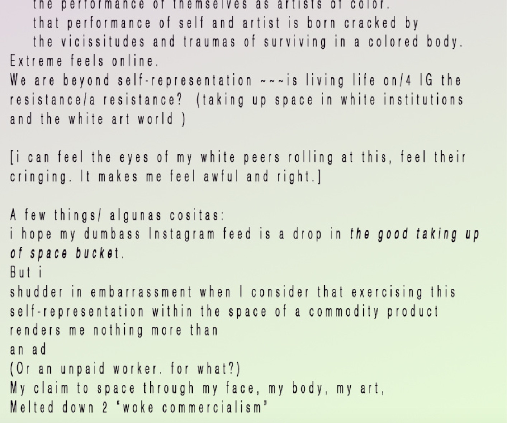](https://www.sofiacordova.com/YUNG-NARCISX)

[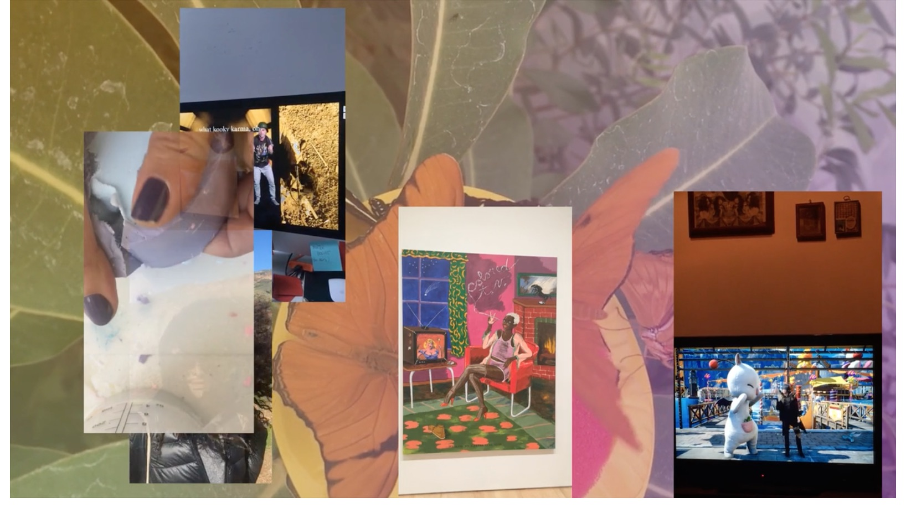](https://www.sofiacordova.com/YUNG-NARCISX)

